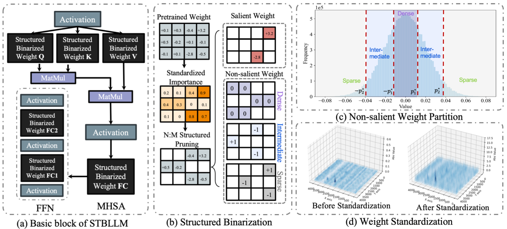
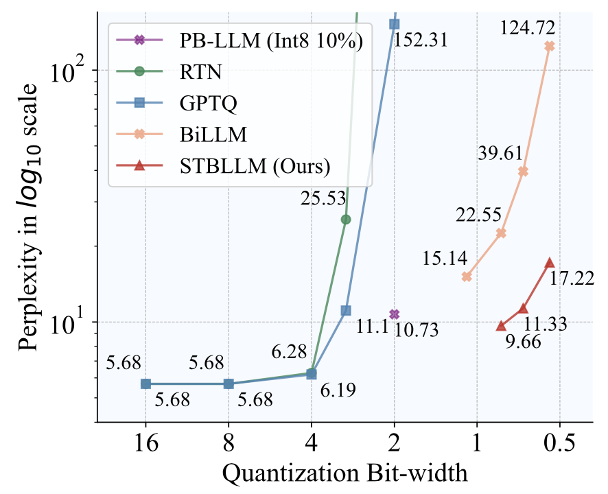
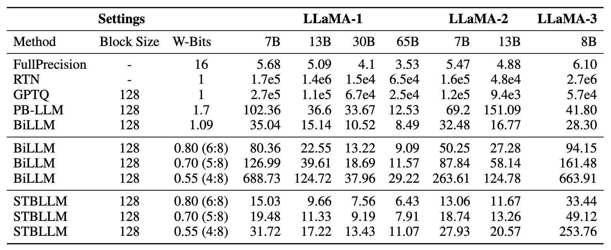
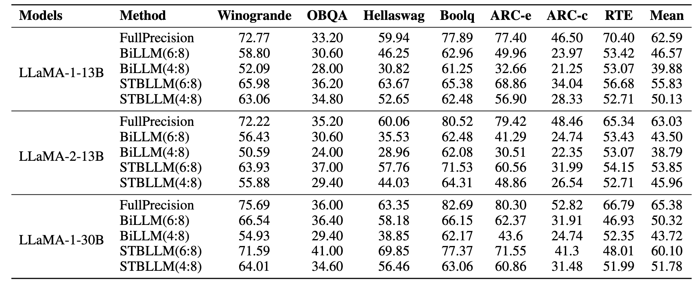
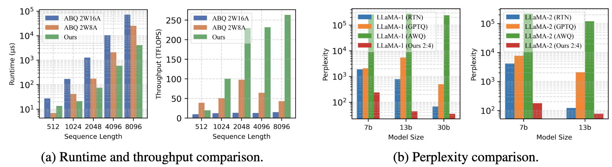

# STBLLM: Pushing the Limit of Post-Training Quantization for LLMs [[PDF]](https://arxiv.org/abs/2408.01803)

Peijie Dong $^{1,\dagger}$, Lujun Li $^{2,\dagger}$, Yuedong Zhong $^{3}$, Dayou Du $^{1}$, Ruibo Fan $^{1}$, Yuhan Chen $^{1}$, Zhenheng Tang $^{1,4}$, Qiang Wang $^{5}$, Wei Xue $^{2}$, Yike Guo $^{2,*}$, Xiaowen Chu $^{1,2*}$

$^{1}$ HKUST(GZ)    $^{2}$ HKUST    $^{3}$ SYSU    $^{4}$ HKBU    $^{5}$ HIT(SZ)





## Abstract 

In this paper, we present the first structural binarization method for LLM compression to less than 1-bit precision. Although LLMs have achieved remarkable performance, their memory-bound nature during the inference stage hinders the adoption of resource-constrained devices. Reducing weights to 1-bit precision through binarization substantially enhances computational efficiency. We observe that some weights in binarized LLMs can be randomly flipped without significant performance degradation, suggesting the potential for further compression. To exploit this, our STBLLM employs an N:M sparsity technique to achieve structural binarization of the weights. Specifically, we introduce a novel Standardized Importance (SI) metric, which considers weight magnitude and input feature norm to more accurately assess weight significance. Then, we propose a layer-wise approach, allowing different layers of the LLM to be sparsified with varying N:M ratios, thereby balancing compression and accuracy. Furthermore, we implement a fine-grained grouping strategy for less important weights, applying distinct quantization schemes to sparse, intermediate, and dense regions. Finally, we design a specialized CUDA kernel to support structural binarization. We conduct extensive experiments on LLaMA-1/2/3, OPT family, and Mistral to evaluate the effectiveness of STBLLM. The results demonstrate that our approach performs better than other compressed binarization LLM methods while significantly reducing memory requirements.


## News

- [2025/6] *STBLLM* source code is open now!
- [2025/6] Due to patent application and other reasons, the kernel will be released later.

## Dependencies

```
conda create -n stbllm python==3.10
pip install -r requirements.txt
```

* `torch`: tested on v2.6.0
* `transformers`: tested on v4.35.0
* `datasets`: tested on v2.14.6
* `huggingface-hub`: tested on v0.16.4

## Quick Start

To run STBLLM on your model, use the following command:

```
python3 run.py ${MODEL_NAME} ${DATASET_NAME} braq --blocksize 128 \
    --salient_metric hessian \
    --prune_method si_structure \
    --reconstruction \
```

To replicate the results of Llama2 under 4:8 sparsity, use the scripts in the demo:

```
bash scripts/run_demo.sh
```

We also provide the log of above scripts for you to compare [here](./logs/stbllm_series/stbllm_wikitext2_si-structure-4:8-0.5-wrec_hessian-4mask-billm-160_main.log)

## Performance








## Acknowledgements

We would like to acknowledge and thank the following works that inspired and contributed to this project:

Here’s the updated list with the correct GitHub links for **RIA** and **OWL**:

- [**BiLLM**](https://github.com/Aaronhuang-778/BiLLM): First Post-Training Quantization Framework for Binarized Large Language Models
- [**GPTQ**](https://github.com/IST-DASLab/gptq): Accurate Post-training Compression for Generative Pretrained Transformers
- [**AWQ**](https://github.com/mit-han-lab/llm-awq): Activation-aware Weight Quantization for LLM Compression and Acceleration
- [**PB-LLM**](https://github.com/hahnyuan/PB-LLM): Partially Binarized Large Language Models
- [**SparseGPT**](https://github.com/IST-DASLab/sparsegpt): Efficient Sparsification Approach for Large Language Models
- [**Wanda**](https://github.com/locuslab/wanda): Weight-Based Pruning for Neural Networks
- [**RIA**](https://github.com/biomedical-cybernetics/Relative-importance-and-activation-pruning): Relative Importance and Activation Pruning for Large Language Models
- [**OWL**](https://github.com/luuyin/OWL): Optimized Layer-wise assignment for Efficient LLMs


## Citation

If you find *STBLLM* is useful and helpful to your work, please kindly cite this paper:

```bibtex
@inproceedings{dong2025stbllm,
    title={STBLLM: Breaking the 1-Bit Barrier with Structured Binary LLMs},
    author={Peijie Dong and Lujun Li and Yuedong Zhong and DaYou Du and Ruibo FAN and Yuhan Chen and Zhenheng Tang and Qiang Wang and Wei Xue and Yike Guo and Xiaowen Chu},
    booktitle={International Conference on Learning Representations (ICLR)},
    year={2025},
    url={https://openreview.net/forum?id=6XUSDvBFkV#},
}
```
